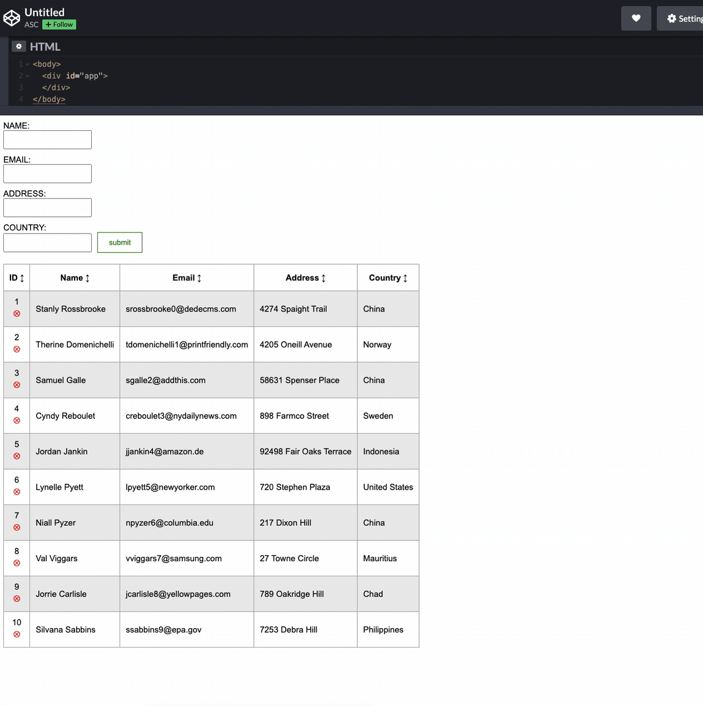

# Requirements

Using only HTML, CSS and JavaScript create an address book. Use the attached design mockup for design and layout. Free to use any documentations available online.

* As a User, I should be able to create a new address.
* As a User, I should be able to delete an address.
* As a User, I should be able to see all the address from the mock data.
* As a User, I should be able to sort by column (A to Z or Z to A).

## Acceptance criteria:

*	When a user hovers over the submit button, the button background color should change to green
*	When a user deletes a record, an alert notification needs to show with the following message “Confirm deletion of: Therine Domenichelli” with “Cancel” and “Ok” button. If the User presses “Ok” delete the record and update UI. If User presses “Cancel” close alert notification and do not delete record. 
*	New address should be added to the bottom on the list with an ID incremented by 1.
*	New address form should have the following fields: Name, Email, Address, and Country.
*	If any of the form fields are incomplete, an alert message shows “Please complete all fields in the form” and submission is prevented.
*	Data does not need to persist

### Bonus 1: 
Use CSS selectors (i.e., pseudo class selectors) to style elements.

### Bonus 2:
Use web component architecture.

### Bonus 3:
Performance enhancement consideration

Use any online HTML, CSS, JavaScript coding editor. If you don’t have a preference, please use:
https://codepen.io/pen/

## Interactive Design Mockup

